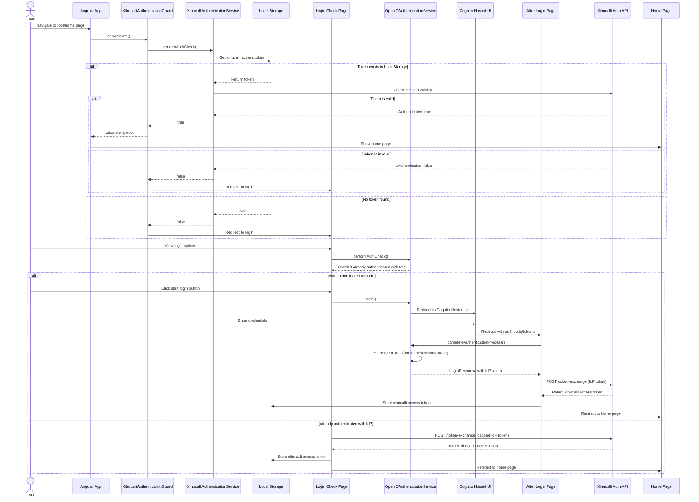

# Authentication flow #

The authentication process is the following.

The user go to the root or home pages.
The application checks the user xihucalli token with the XihucalliAuthenticationGuard and service
If the user has a valid token, the user go to the home page.
If the user doesn't have a valid xihucalli access token, the application shows the login check page
The user can decide which identity provider to get a valid access token specific for itself.
Once the authentication process finishes successfully, the specific access token is used to be sent to xihucalli authentication api
to get a xihucalli access token that will be stored in the local storage.
When the user go to the home page or any other, it will read this stored access token.

## Authentication Flow Diagram

